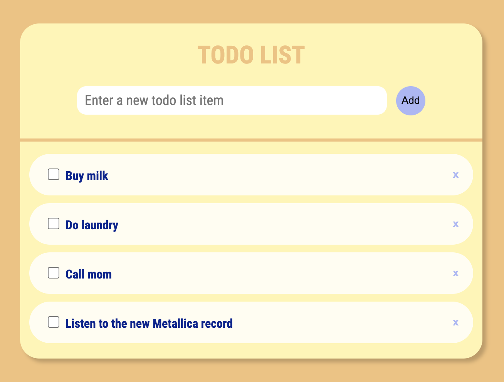
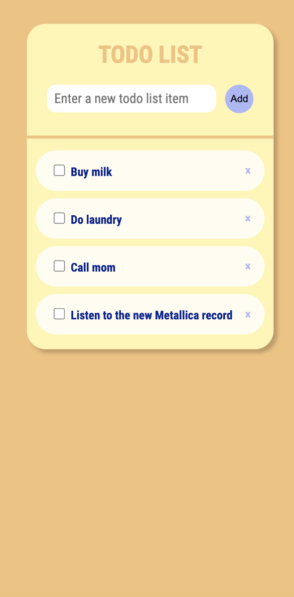

# Todo list
This is a classic todo list project made in a couple of hours using React. It has some very simple features such as adding, archiving and removing items from the list. The app uses local storage, meaning that list items persist in case of a page refresh.

### Try it out
https://fredrikgson-todolist.netlify.app/

### Preview

  <figure>
    
    <figcaption>Todo list on desktop</figcaption>
  </figure>
   
  <figure>
    
    <figcaption>Todo list on mobile</figcaption>
  </figure>

